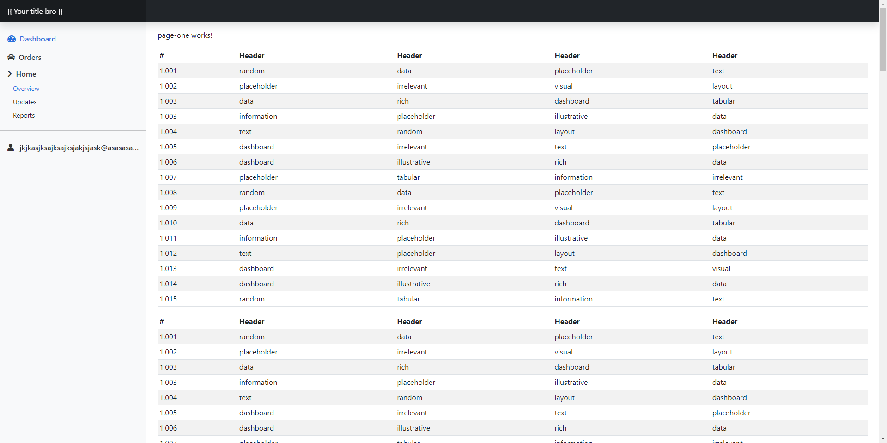

# First of all

Run `npm i` to install node modules

# Bootstrap Angular Admin Template

This is a dashboard template made with Angular and Bootstrap v5
It contains the basic Angular structure to start a new project

This project was generated with [Angular CLI](https://github.com/angular/angular-cli) version 15.1.4.

# Branches
There are two different branches to start the project
- **Main branch:**
    - Dashboard routing and pages (server errors, page-one, page-two as example).
- **Auth Branch:**
    - Dashboard module, routing and pages (server errors, page-one, page-two as example).
    - Auth module, routing and pages (register, forgot password, login).

## Development server

Run `ng serve` for a dev server. Navigate to `http://localhost:4200/`. The application will automatically reload if you change any of the source files.

## Code scaffolding

Run `ng generate component component-name` to generate a new component. You can also use `ng generate directive|pipe|service|class|guard|interface|enum|module`.

## Build

Run `ng build` to build the project. The build artifacts will be stored in the `dist/` directory.

## Example
